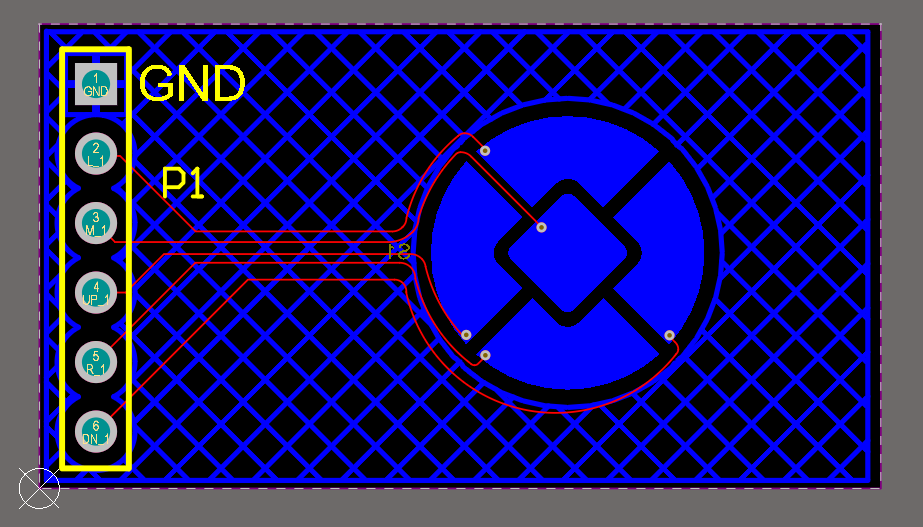
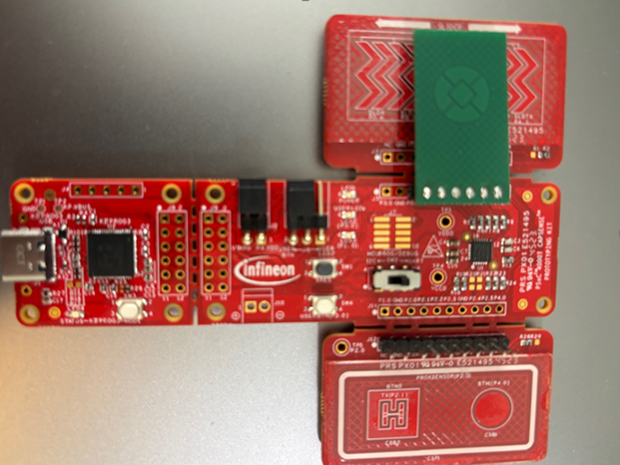
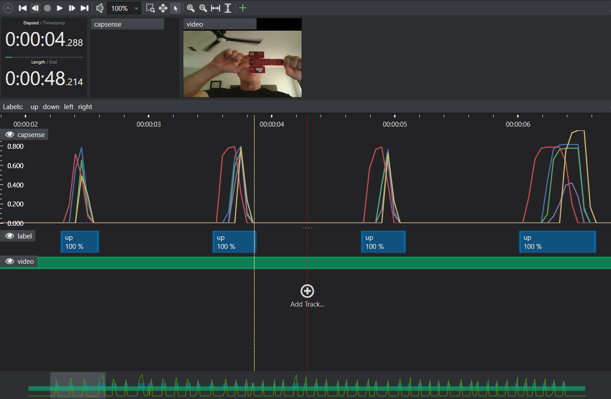

# Capsense Gesture Detection

## Overview - Use-Case

The project uses capacitive sensing (CAPSENSE™) technology to interpret gesture patterns and improve user interface interactions.
A supervised learning model is trained on touch-based sensor data to accurately classify gestures. This touch interactive project enables users to detect directional gestures such as 
+ Swipe Up
+ Swipe Down
+ Swipe Left
+ Swipe Right

This project allows for a seamless and efficient interface, particularly suited for embedded systems and smart devices.
CAPSENSE provides a compact and reliable method for gesture recognition, making it ideal for devices where traditional mechanical buttons are impractical or undesirable.
This technology enhances user experience across a range of modern products, including:
+ Smart home control panels
+ Wearable devices
+ Automotive touch interfaces

By replacing physical buttons with intuitive gesture-based controls, this approach offers users a smoother, more natural, and space-efficient interaction model.

## Contents

`Data` 	- Folder to store the Up, Down, Left and Right gesture datasets.

`Models` - Folder where trained models, their predictions and generated Edge code are saved. 

`Resources` - Folder where all extra resources/files can be found.

`Tools`	- Folder containing a python script used for downsampling data.

## Sensor & Data

This project uses data collected with a CAPSENSE-based custom board which consists of 5 slider segments connected to a PSOC4 board.
The CAPSENSE sensor is designed using multiple capacitive electrodes arranged to detect directional gestures such as up-swipe, down-swipe, left-swipe and right-swipe. Each electrode senses changes in self-capacitance when a finger approaches or touches the overlay surface. The overlay, typically made of plastic or glass, acts as a dielectric layer and influences the sensor’s sensitivity based on its thickness and material properties. The capacitance is modeled using the parallel plate capacitor equation:

C = ( epsilon_0 * epsilon_r * A) / D

where,
epsilon_0 is the free space permittivity, 

epsilon_r is the dielectric constant of the overlay,
 
𝐴 is the area of overlap between the finger and the sensor pad and 𝐷 is the overlay thickness.

The image above shows the PCB layout of the custom capacitive sensor board designed for the project. The P4_iMob_FabFiles located in the Resources folder contain all necessary fabrication assets and can be provided to a PCB manufacturer to build the custom board. On the left side of the board, there is a vertical
row of six pins, labeled with signal identifiers such as GND and P1. Each pin on the left side of the PCB corresponds to a specific gesture zone. 
When a finger touches or approaches the area above a pin’s associated electrode, the CAPSENSE system detects a change in capacitance and it is send to the model which then interprets it as a specific directional gesture. 
These pins serve as connection points to the main controller or evaluation kit.

| **Pin Label(P1)** | **Gesture Function**|
|-----------|-------------------------|
| 1         | Ground reference        |
| 2         | Left                    |
| 3         | Middle                  |
| 4         | Down                    |
| 5         | Right                   |
| 6         | Up                      |

## Adding More Data

The project utilizes PSoC4000T EVK (CY8CPROTO-040T) plus custom sensor board.
To collect more data ensure that boards are connected as shown in the image below. 

To start the project, create an example CAPSENSE project by selecting the peripherals as ¨UART Transmit and Receive¨ in ModusToolbox IDE. Set up data transmission over UART to a PC running the Imagimob Capture Server software.
Configure the UART, RX, and TX by referring to the code snippet located at Resources > uart_configuration_code_snippet and collect data using the [Capture Server](https://bitbucket.org/imagimob/captureserver/src/master/).
The collected data in this project has been downsampled using the provided script to optimize model efficiency and reduce computational overhead.

To tune the CAPSENSE custom board, get the sensor parasitic capacitance and use [ModusToolbox™ CAPSENSE™ Tuner](https://documentation.infineon.com/modustoolbox/docs/pdn1712080509469) for tuning.

Shown below is the recording window, where each waveform color—violet, green, yellow, blue, and red corresponds to the left, middle, up, right, and down slider segments on the custom board. The displayed data is labeled as ‘up’.

## Steps to Production
To bring a gesture detection model to production involves collecting gesture samples from a wide range of users and environments. Diversity in data ensures that the model learns to generalize across real-world conditions and reduces the risk of overfitting to a narrow set of inputs. 

Gesture recognition performance can be affected by whether the device is handheld or mounted, the material and shape of the surface, and the presence of external disturbances. Environmental influences such as humidity and long-term wear on the sensor can also alter signal characteristics. To build a robust and reliable model, it is essential to capture data across these diverse conditions and incorporate them into the training pipeline.

It is crucial to properly split the dataset into training, validation, and test sets. The test set should contain data that is entirely separate from the training and validation sets, ideally from different users or environments. This separation allows for accurate evaluation of the model’s ability to generalize to unseen scenarios and ensures that performance metrics reflect real-world behavior.

To further enhance model reliability, negative samples should be included in the dataset. These are examples where no gesture is present, or where random hand movements occur. Including such data helps the model learn to distinguish between intentional gestures and irrelevant signals, reducing false positives and improving robustness in noisy or unpredictable environments.

The model should be tested in real-world conditions to identify edge cases (eg: using wet or gloved hands, gestures executed too quickly or too slowly), monitor performance and gather user feedback. A feedback loop could be established to collect new data post-deployment, enabling periodic retraining and updates. This continuous learning process ensures that the gesture detection model remains accurate, adaptive, and production-ready over time.
