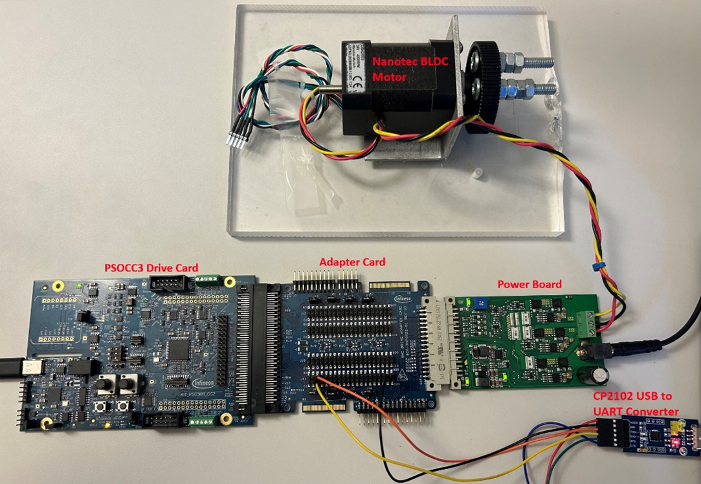
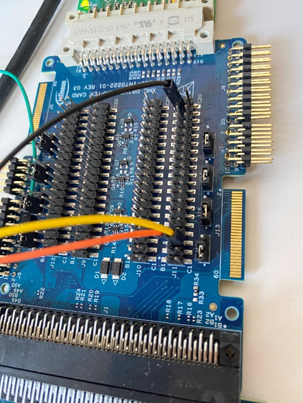
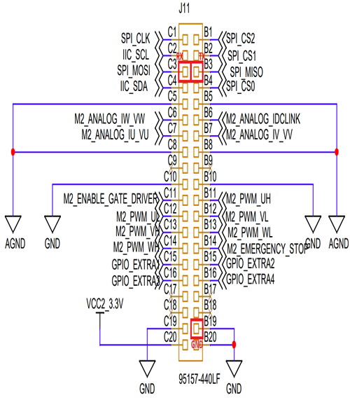
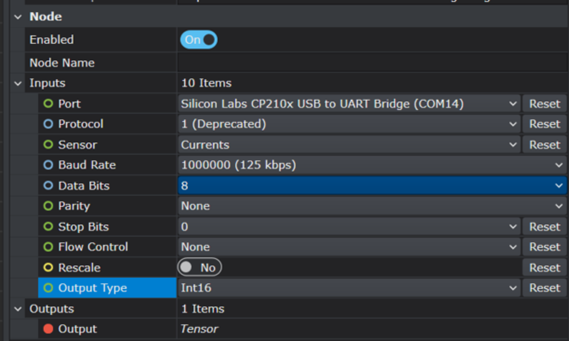
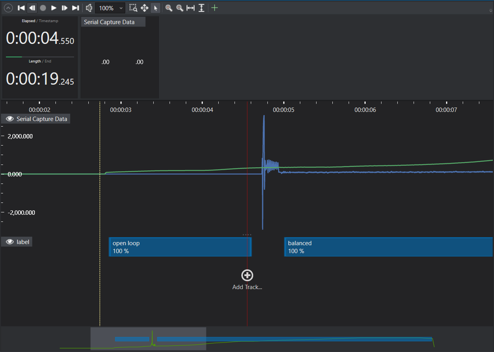

# Motor Imbalance Detection

## Overview - Use-Case

This project allows you to develop an AI model capable of detecting imbalances in the motor load while the motor is operating.

This project applies supervised Learning where the system categorizes collected data into three distinct classes: 
+ Balanced - A balanced motor state means the rotor is evenly aligned around its axis, resulting in minimal vibration and stable performance.
+ Unbalanced - An unbalanced motor experiences uneven forces or electrical inputs which leads to instability in its operation.
+ Open loop - The system sends commands to the motor without verifying its actual response as there is no feedback loop from the motor to 
              the controller.

The model helps to improve energy efficiency by detecting motor imbalance. Imbalance leads to excessive heating in the motor windings, 
which reduces operational efficiency. By identifying these issues promptly, the model also contributes to extending the motor’s lifespan 
and supports quality control in manufacturing environments.

The model is suitable for real-time, low powered embedded applications such as:
- Industrial machines (conveyers, pumps, compressors)
- Automotive systems (Electrical Vehicle motors, actuators)
- Consumer applications (washing machines, fans, power tools)
- Robotics and automation

## Contents

`Data` 	- Folder to store the current and speed signals of the motor.

`Models` - Folder where trained models, their predictions and generated Edge code are saved. 

`Resources` - Folder where all extra resources/files can be found.

`Tools`	- Folder containing the GraphUX unit to collect data and evaluate the model in Studio, along with the corresponding .hex file.

`PreprocessorTrack` - Folder containing preprocessed data tracks (i.e. the output of the preprocessor).

## Sensors and Data

This project utilizes the PSOC C3 Motor Control Kit (KIT_PSC3M5_MC1) for data collection. The kit includes the following components: 
- PSOC C3 Drive Card
- Nanotec DB42M03 electric Motor

To complete the setup, the following additional hardware is required (not included in the Motor Control Kit):

- Motor wheel
- Screws for load
- Base plate to fix the motor
- CP2102 USB-UART converter for data collection and streaming

An Analog-to-digital converter (ADC) is used for data acquisition, with a sampling frequency set to 15kHz. The sampled data consist of 3 x 12-bit
raw integer values which represent the quantized phase currents of motor. The motor control algorithm calculates Iq (quadrature-axis current) and 
speed (RPM). Frequency-domain features are extracted by applying FFT to Iq and speed, which are then used as input to the ML model for imbalance
classification.

The data provided in the project consists of 25 sessions and the data is labelled as Balanced, Unbalanced and Open loop.
Motor balance is achieved by mounting screws symmetrically around the wheel, ensuring even weight distribution. In contrast, 
imbalance occurs when screws are clustered on one side, leading to uneven mass, which introduces disturbances and causes unstable 
oscillations in motor speed.

## Adding More Data

To prepare the PSOC C3 Motor Control Kit (KIT_PSC3M5_MC1) for data collection:
- Ensure the motor is properly connected to the power board.
- Connect the PSOC C3 drive card to the adapter board, the power board, and the CP2102 USB-UART converter as illustrated in the image below.

To start streaming data to Deepcraft studio first, ensure that the driver for the USB to UART converter (CP210x) device is installed on the 
computer which will be used for data collection in Studio. The USB to UART converter supports 15kHz data streaming to Studio. The converter used in the project
is available at:
https://www.reichelt.com/se/en/shop/product/developer_boards_-_usb_type-a_to_uart_cp2102-266051?country=se&CCTYPE=private&LANGUAGE=en.

Next connect the CP210x device to the adapter board. RXD of the converter must be 
connected to C3 pin of the J11 pin group. TXD of the converter must be connected to B3 pin of the J11 pin group. GND of the converter can be 
connected to B19 of the J11 pin group. The connections are shown in the figure below:

Flash the code using the Modus Toolbox Programmer on to the PSOC C3 drive card. The .hex file can be accessed by navigating to 
Tools > Data Collection. The main steps for flashing the .hex file are similar to those described at this link
https://developer.imagimob.com/getting-started/infineon-ai-evaluation-kit#streaming-firmware-for-psoc-6-ai-evaluation-kit

### Methods to capture data 

#### Option 1: Predefined GraphUX Project

Launch Deepcraft Studio. Open the Main.imunit file by double-clicking it. Click on the Serial Capture block and adjust the COM port 
settings. Select the correct COM port using the configuration shown in the figure below.

If the sensor and sample rate are not detected:

+ Try changing the stop bit setting.
+ Right-click anywhere in the workspace and click Start to begin data capture.

#### Option 2: Create the project from scratch by following the guidelines provided in the Deepcraft Studio documentation.

The figure below shows the recording window, where the blue waveform represents current and the green waveform indicates motor speed. 
The data is labeled as 'open loop' and 'balanced'.

## Steps to Production

Bringing a motor imbalance detection model into production requires careful consideration of the specific use-case and motor system it is intended for. Factors such as speed variations, load changes, mounting orientation and environmental conditions can all influence the nature of imbalance signals and therefore the data needed to train and refine the model.

Imbalance detection can be affected by whether the motor is mounted horizontally or vertically, the type of mechanical load it drives and the presence of external vibrations. Environmental influences like temperature shifts, humidity and long-term wear can also alter signal patterns. Capturing data across these varied conditions and incorporating it into the training process is essential for building a robust and reliable model.

It is equally important to include negative samples in data from normal operation, startup transients(eg:sudden spikes or dips in current or voltage, rapid changes in vibration or torque etc) and other non-imbalance events to help the model distinguish true imbalance from unrelated noise. If the model is designed to detect imbalance specifically also gather data from other fault types such as misalignment or bearing wear to improve its precision.

To ensure the model generalizes well test it under both typical operating conditions and edge cases (eg:extreme speeds or loads, sudden changes in directions etc). Begin with your test dataset but also run live sessions to evaluate how the model performs in real-world scenarios.