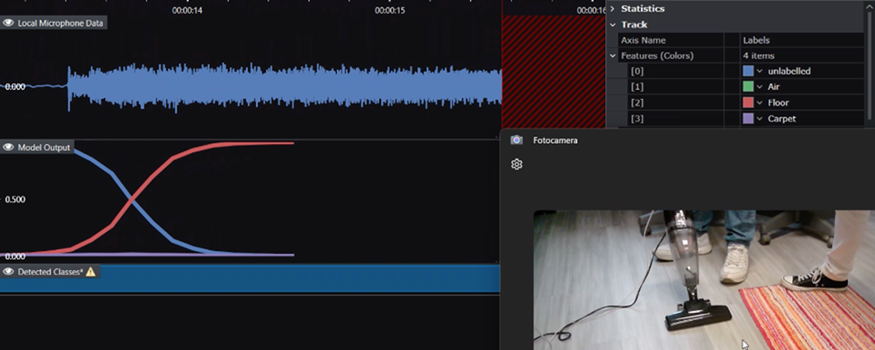
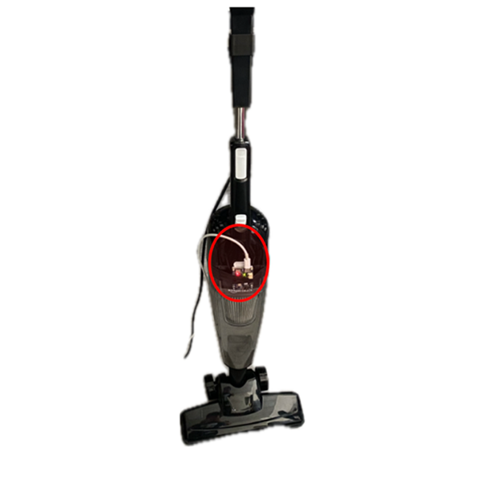
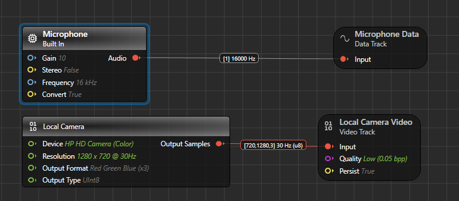

# Surface Detection for Vacuum Cleaners - Starter Model Project

## Use-case description

This starter model offers a framework to develop a **surface detection project** for recognizing different surfaces (Floor, Carpet, or Air) based on sound patterns generated by a vacuum cleaner. The goal is to enable classification of these surfaces by analyzing the vacuum cleaner's audio signals as it operates.

The project is designed for use with a simple and inexpensive vacuum cleaner, but the methodology can be adapted to other models or machinery with similar sound-based differentiation characteristics.

This is a **classification project**, a type of Supervised Learning where the system categorizes data into distinct classes. In this project, the three classes are Floor, Carpet, and Air.

### How can I know if this project fits my use case?

This project is suitable if:

- You aim to identify or classify different surfaces based on the noise signature of a vacuum cleaner or similar machinery.
- You can collect data representing the behavior of the vacuum cleaner across all target surface types (Floor, Carpet, Air).

If you cannot gather sufficient data for all three surface types, or if the audio signals of your machine do not vary significantly across those surfaces, this approach may yield less accurate results.

### How can this project ease my go-to-production journey?

This starter project provides a streamlined approach to build a surface detection machine learning model. By using this as your starting point, you’ll gain access to:

- A pre-configured framework to perform surface classification based on audio signals.
- Built-in preprocessing and data windowing settings.
- Predefined model architectures optimized for this task, which can be deployed easily.

## Contents

`Data` - Folder for storing your audio dataset.

`Models` - Folder for saving trained models, predictions, and edge-deployable code.

`PreprocessorTrack` - Folder containing preprocessed data tracks (i.e. the output of the preprocessor).

`Resources` - Images and collaterals used in this README file. Not relevant for the ML part.

`Units` - Folder for adding custom layers or preprocessors (not used in this project).

`Tools/DataCollectionGraphUX` - Includes a data collection project using GraphUX, enabling efficient data acquisition.

## Sensor settings specification

This project requires the [PSOC™ 6 AI Evaluation Kit](https://www.infineon.com/cms/en/product/evaluation-boards/cy8ckit-062s2-ai/), which includes a PSoC™ 6 MCU and Infineon digital microphones. The kit is ideal for prototyping, enabling real-world data collection to rapidly develop machine learning solutions.

For this specific example, the PSOC 6 AI Kit board was simply taped to a cheap vacuum cleaner, on the front side.

While this project uses a vacuum cleaner, the methodology can be adapted to other machinery or setups. If you want to replicate the functionality out-of-the-box, you can follow the provided steps.

## Collecting and expanding the dataset

To gather new data, you must flash and configure the [Imagimob Streaming Protocol Firmware](https://github.com/Infineon/mtb-example-imagimob-streaming-protocol/blob/master/README.md) on your PSoC™ 6 AI Kit. Refer to the firmware's README for setup instructions.

To initiate data collection with GraphUX, open the `Tools/DataCollectionGraphUX` directory and double-click the `Main.imunit` file. Ensure that the PSOC™ 6 AI Kit is connected to your computer via USB.

Adjust the input parameters in the "Microphone" block to match these settings. Note that you can also configure the webcam input to collect video stream. This is useful if you want a visual clue to label the data after having collected it.

Start the data collection session.

Save the recorded data into the `Data` folder or another directory of your choice. Ensure you collect sufficient data for each target class (Floor, Carpet, Air) to train a robust model.

### A note on data labeling

This project uses three labels corresponding to the three surface types:

- **Floor**: Indicates that the vacuum cleaner is operating on a hard floor surface.
- **Carpet**: Indicates operation on a carpeted surface.
- **Air**: Indicates that the vacuum cleaner is not in contact with any surface (e.g., lifted off the ground).

**Important:** Ensure accurate labeling of your data, as incorrect labels will adversely affect the model’s performance.

## Recommended path to production

Bringing this Starter Model to a production level requires a well-planned data collection strategy to capture sufficient variety in the data, enabling ML models to learn the underlying characteristics that distinguish different surfaces.

### Data Collection Strategy

This is a general guideline on how to lead the data collection process.

**Environmental Diversity:** Collect data across various environments and rooms with different acoustic properties (e.g., small rooms, large open spaces, rooms with different echo characteristics). Background noise variations are crucial for robust model performance in real-world settings. 
Hint: you can leverage DEEPCRAFT Studio's Data Augmentation feature to introduce reverberation, volume variations and background noise in your data. 
If you use Data Augmentation, apply it only to training data.

**Device Variability:** Include recordings from vacuum cleaners with different levels of wear and tear, as motor sounds change significantly over a device's lifetime. The fullness level of the dust tank also affects the acoustic signature and should be varied during data collection.

**Surface Diversity:** Gather data from a wide spectrum of surface types within each category. For floors, include hardwood, tile, vinyl, and laminate. For carpets, collect data from different pile heights, materials, and densities as these significantly affect the sound profile.

**Usage Patterns:** Have different individuals perform the data collection, mimicking actual vacuuming patterns and speeds. Include transitions between surface types, as these edge cases are often challenging for classification models.

### Common Pitfalls to Avoid

**Class Imbalance:** Ensure relatively equal representation of each surface type in your dataset to prevent the model from becoming biased toward over-represented classes. Ensure also not to collect too much data from a single environment or a single setting, which might cause the model to overfit this specific configuration.

**Data Leakage:** Keep test data truly separate from training data, ensuring they come from different recording sessions to prevent artificially inflated performance metrics. Collect a separate testing set by using a different vacuum cleaner, on a previously-unseen surface in a new room. This will provide you a true measure of model performance in a real-usage setting.

**Overfitting to Specific Conditions:** If all carpet data comes from a single carpet type or all floor data from one room, the model will likely fail when encountering new environments.

**Neglecting Real-world Noise:** Include samples with typical household background noises (e.g., TV sounds, conversation, other appliances) to build resilience to interference.

### Optimization Strategy

Prefer collecting multiple shorter samples (60 - 240 seconds) across diverse conditions rather than fewer, longer recordings. This approach captures more variability and creates a more robust training dataset.

Consider an iterative development approach where you first train on a basic dataset, identify failure cases through testing, then collect additional data specifically targeting those edge cases to improve model performance.

## Getting Started

Please visit [developer.imagimob.com](https://developer.imagimob.com), where you can read about Imagimob Studio and go through step-by-step tutorials to get you quickly started.

## Help & Support

If you need support or if you want to know how to deploy the model on to the device, please submit a ticket on the Infineon [community forum ](https://community.infineon.com/t5/Imagimob/bd-p/Imagimob/page/1) Imagimob Studio page.